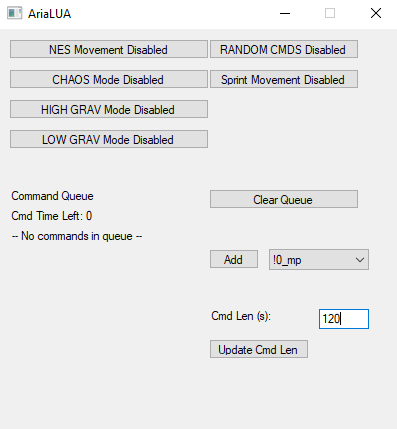

# Aria LUA

By Xanthus

This script for Bizhawk adds some additional settings and modes for Aria of Sorrow 
to introduce some new novel gameplay elements. I created this as the backbone for 
an eventual Twitch integration I'm working on, but you can play only using this 
script to enable the modes below.

Note: This script is currently hardcoded to Aria's default input config,
if you change the input config in-game this wont work as expected.



## Setup
Requires Bizhawk v2.9. To use, download `aria-lua.lua` and put it inside your `Bizhawk 2.9/Lua/GBA/` folder. Once you load the ROM in Bizhawk, then access the LUA console under the `Tools > Lua Console` menu. Then in the LUA console, choose `Script > Open Script` and select the `aria-lua.lua` file, and you should see the Aria Lua form.

## Mode Descriptions

- NES Mode
    - You can't change direction in midair, unless you double jump, or use Flying Armor
    - New movement tech: Slingshot. You can jump out of backdash while holding the opposite direction to keep momentum in the air.
- SPRINT Mode
    - Hold attack to move faster while on the ground
    - You can also do this in water, there's a minor graphical glitch though.
- CHAOS Mode
    - Weapon is randomized after each kill.
    - Red soul is randomized each time you attempt to use a red soul.
- Random CMDs
    - This script will activate random effects over time (similar to other games with Twitch integration)
    - Each effect (aside from 'Instant' effects like changing HP/MP) will last for 120 seconds by default, you can update this in the form.
    - list of commands
        ```
        !nes_mode - Enables NES Movement mode
        !chaos_mode - Enables Chaos mode
        !sprint_mode - Enables Sprint Movement mode
        !bigtoss - Enables high knockback when taking damage !high_grav - Increases falling speed
        !low_grav - Decreases falling speed
        !drop_weapon - Removes player's current weapon (returns to inventory when command expires) 
        !mp_refund - Gain MP cost back after using Red soul.  !100_hp - Sets HP to 100
        !full_heal - Sets HP to max
        !0_mp - Sets MP to 0 
        !heart - Gain 50 MP 
        !give_gold - Gain $5000 gold 
        !steak - Gain 50 HP
        !spectral_crow - (if SETTINGS_REPRISE is set to true) Sets the Spectral Crow room modifier.
        ```
